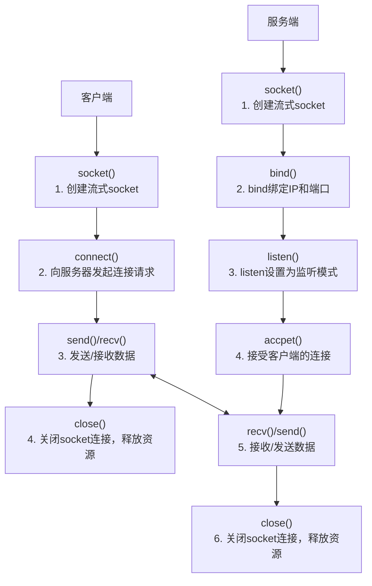

# 流程图

# 网络编程接口
## socket()
```cpp
int socket(int domain, int type, int protocol);
```
**domain**

- `PF_INET`           IPv4
- `PF_INET6`         IPv6
- `PF_LOCAL`         本地通信
- `PF_PACKET`       内核底层
- `PF_IPX`             IPX Novell

**type**

数据传输类型

- `SOCK_STREAM`       面向连接的socket
  - 数据不会丢失
  - 数据顺序不会错乱
  - 双向通道
- `SOCK_DGRAM`         无连接socket
  - 数据可能丢失
  - 数据顺序可能错乱
  - 传输效率更高

**protocol**

TCP:`IPPROTO_TCP`

UDP:`IPPROTO_UDP`

**Return Value**

成功返回一个有效socket,失败返回-1,errno被设置

**example**
```cpp
int sockfd = socket(AF_INET, SOCK_STREAM, 0);
```

# connect()
```cpp
int connect(int sockfd, const struct sockaddr * addr, socklen_t len);
```
sockfd即socket函数返回值

`sockaddr`结构体，一般用更便捷操作的`sockaddr_in`结构体类型转化而来

`sockaddr_in`结构体 成员变量设置代码参考如下：
```cpp
struct sockaddr_in servaddr;
memset(&servaddr, 0, sizeof(servaddr));
servaddr.sin_family = AF_INET;
servaddr.sin_port = htons(port);

struct hostent *h;
  if ((h = gethostbyname(ip)== nullptr) {
  std::cerr << "gethostbyname() failed\n";
  close(sockfd);
  return -1;
}
memcpy(&servaddr.sin_addr, h->h_addr, h->h_length);
```
其中，使用`gethostbyname`函数的目的是将字符串类型的ip地址转化为便于计算机网络传输的

**example**
```cpp
connect(sockfd, (struct sockaddr *)&servaddr, sizeof(servaddr))
```

# send()
```cpp
ssize_t send(int sockfd, const void *buf, size_t nbytes, int flags);
```

`flags`参数一般就设置为0(默认行为),但其实flags有许多参数可以设置，具体参数含义可以在linux系统中使用`man 2 send`命令查看

# recv()
```cpp
ssize_t recv(int sockfd, void *buf, size_t nbytes, int flags);
```

# bind()
```cpp
int bind(int sockfd, const struct sockaddr *addr, socklen_t len);
```

# listen()
```cpp
int listen(int sockfd, int backlog);
```

`backlog`参数，简单说就是**控制等待处理的连接请求队列的最大长度**

# accept()
```cpp
int accept(int sockfd, struct sockaddr *restrict addr, socklen_t *restrict len);
```

看起来，`accept()`和`socket()`很像，确实如此。但是`accept()`返回的描述符是连接到调用`connect()`的客户端，原始套接字（通过`socket()`）创建的继续保持可用状态并接收其他连接请求